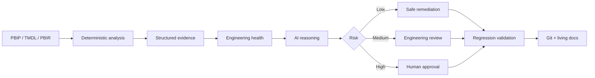

<div align="center">

# Rabindra Rizal
### Building intelligent systems behind enterprise decisions.

**AI × Analytics × Automation × Product Leadership**

I work at the intersection of enterprise analytics, engineering systems and responsible AI — turning ambiguous business problems into products that are measurable, governable and usable after launch.

[Portfolio](https://robzal77.github.io/rabindra-portfolio/) · [Résumé](https://robzal77.github.io/) · [LinkedIn](https://www.linkedin.com/in/rabindrarizal)

</div>

---

## What I build

```text
BUSINESS PROBLEM
      ↓
PRODUCT + ARCHITECTURE
      ↓
DATA / AUTOMATION / AI
      ↓
EVIDENCE + HUMAN CONTROL
      ↓
ADOPTION
      ↓
MEASURABLE OUTCOME
```

My work is less about adding AI to a dashboard and more about redesigning the system around the decision.

## Flagship systems

| | System | What makes it interesting |
|---|---|---|
| 🟨 | **Power BI Intelligence Hub** | An engineering intelligence layer for Power BI: inspect PBIP/TMDL/PBIR, build evidence, score health, reason with AI, classify remediation risk and keep humans authoritative for material changes. **Private implementation · public architecture case study.** |
| 🟩 | **Nagrik Resolve** | A synthetic-data civic-service prototype built around reconciliation, verified rules, pre-flight readiness, failure recovery, accessibility and explicit trust boundaries. **Private implementation · public product case study.** |
| 🟦 | **Enterprise BI Engineering** | Treating BI as software engineering: semantic standards, PBIP/TMDL, Git, automated validation, health scoring, governance and repeatable delivery systems. |
| 🟪 | **Robin Intelligence OS** | A personal operating-system concept connecting work, knowledge and decision signals into one intelligence layer while keeping private data private. |

### → [Explore the flagship case studies](https://github.com/Robzal77/rabindra-portfolio#flagship-builds)

---

## Power BI Intelligence Hub — the idea in 30 seconds



> **Source evidence → deterministic validation → AI reasoning → human authority.**  
> Multiple AI agents agreeing with one another is not validation.

**Designed health domains:** `Model Quality` · `Performance` · `DAX` · `Report UX` · `Accessibility` · `Security` · `Documentation` · `Governance` · `Maintainability`

### → [Read the Power BI Intelligence Hub case study](https://github.com/Robzal77/rabindra-portfolio/blob/main/case-studies/power-bi-intelligence-hub.md)

---

## Selected evidence

| Enterprise problem | System response | Outcome / signal |
|---|---|---|
| Multi-zone sustainability reporting | Governed analytics product + operating controls | **90% less manual effort · 97% reported accuracy** |
| Fragmented BI delivery | Standards + automation + reusable engineering model | **~7 FTE annual value · 40% less fragmentation · 67% less recurring work** |
| Slow European daily-sales reporting | Modernized analytics product + adoption loop | **13h → 2h refresh · 260+ daily views · NPS 46 → 81** |

*Portfolio metrics are presented as professional case-study evidence; confidential employer data and proprietary implementation details are intentionally excluded.*

---

## How I think about enterprise AI

**Deterministic where exactness is possible. AI where judgment adds value. Humans where accountability matters.**

That translates into five design rules:

1. Evidence before explanation.
2. Contracts before free-form agent handoffs.
3. Risk classification before automated change.
4. Tests and Git own durable state — agents do not.
5. Adoption and measurable outcomes matter more than an impressive demo.

---

## Current technical themes

`Power BI` · `Microsoft Fabric` · `PBIP` · `TMDL` · `PBIR` · `Databricks` · `SQL` · `Python` · `Git` · `Analytics Engineering` · `AI Workflows` · `Governance` · `Product Thinking` · `Program Leadership`

---

<div align="center">

### Build systems people can trust — and prove why they should.

[**View Portfolio**](https://robzal77.github.io/rabindra-portfolio/) · [**View Résumé**](https://robzal77.github.io/) · [**Connect on LinkedIn**](https://www.linkedin.com/in/rabindrarizal)

</div>
