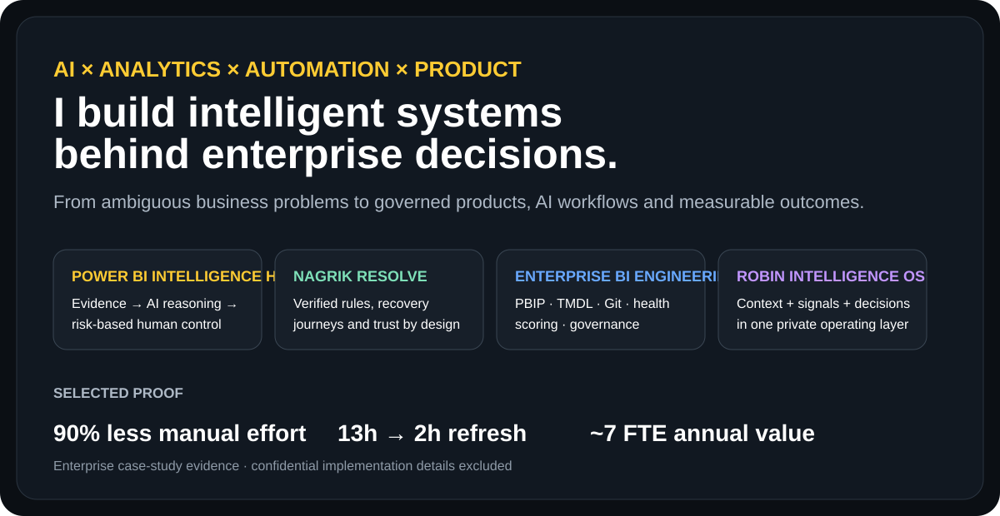
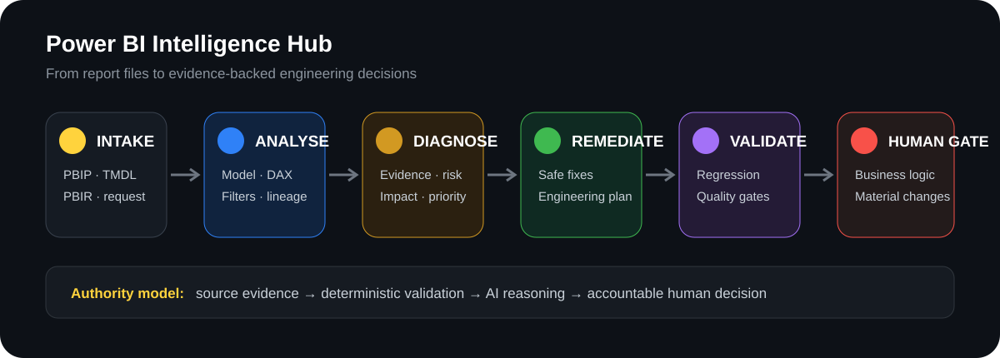

# Rabindra Rizal
### Building intelligent systems behind enterprise decisions.

**AI × Analytics × Automation × Product Leadership**

[Portfolio](https://robzal77.github.io/rabindra-portfolio/) · [Résumé](https://robzal77.github.io/) · [LinkedIn](https://www.linkedin.com/in/rabindrarizal)

## Flagship systems

### 🟨 Power BI Intelligence Hub
**AI engineering intelligence for Power BI.**  
Turns report artifacts into evidence, health signals, risk-classified improvements and controlled remediation.

→ [Read the case study](https://github.com/Robzal77/rabindra-portfolio/blob/main/case-studies/power-bi-intelligence-hub.md)

### 🟩 Nagrik Resolve
**Trust-oriented digital public-service workflow.**  
Reconciliation, verified rules, pre-flight readiness, failure recovery, accessibility and explicit trust boundaries.

→ [Read the case study](https://github.com/Robzal77/rabindra-portfolio/blob/main/case-studies/nagrik-resolve.md)

### 🟦 Enterprise BI Engineering
**Treating BI like software engineering.**  
Semantic standards · PBIP/TMDL · Git · automated validation · health scoring · governance.

### 🟪 Robin Intelligence OS
**A private personal intelligence operating-system concept.**  
Work + knowledge + signals → intelligence layer → decisions, context and proactive actions.

---

## Power BI Intelligence Hub — 30-second view

**The design principle:** evidence first, AI for judgment, human authority where accountability matters.

**Designed health domains:** Model Quality · Performance · DAX · Report UX · Accessibility · Security · Documentation · Governance · Maintainability

---

## Selected proof

### 90% less manual effort
Global sustainability reporting moved toward a governed analytics product with stronger operating controls and **97% reported accuracy**.

### 13h → 2h refresh
European daily-sales reporting was modernized while reaching **260+ daily views** and improving **NPS from 46 → 81**.

### ~7 FTE annual value
A reusable BI engineering operating model targeted **40% less fragmentation** and **67% less recurring work**.

Case-study evidence only. Confidential employer data and proprietary implementation details are intentionally excluded.

---

## How I design enterprise AI

**Evidence before explanation.**  
**Deterministic where exactness is possible.**  
**AI where judgment adds value.**  
**Humans where accountability matters.**

I prefer contracts over free-form agent handoffs, risk classification before automated change, and tests/Git as durable state rather than hidden agent memory.

---

## Current technical themes

`Power BI` · `Microsoft Fabric` · `PBIP` · `TMDL` · `PBIR` · `Databricks` · `SQL` · `Python` · `Git` · `Analytics Engineering` · `AI Workflows` · `Governance` · `Product Thinking` · `Program Leadership`

---

### Build systems people can trust — and prove why they should.

[**View Portfolio**](https://robzal77.github.io/rabindra-portfolio/) · [**View Résumé**](https://robzal77.github.io/) · [**Connect on LinkedIn**](https://www.linkedin.com/in/rabindrarizal)

